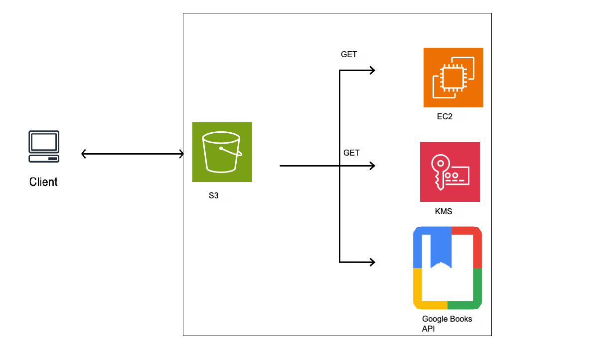

# reading-tracker
# Deployment Chart


## Overview

This project implements a web application where users can search for books using the Google Books API and store selected books in a DynamoDB table. The application serves a frontend hosted in an S3 bucket and a Flask backend running on an EC2 instance.

## Launch the API

To launch the Flask API, ensure that your EC2 instance has a security group that allows HTTP (port 8080) and SSH (port 22) access. You can verify your security groups using the AWS CLI:

```bash
aws ec2 describe-security-groups
```
To create and launch the EC2 instance with the appropriate IAM role and user data for installing the necessary dependencies and running your application, use the following command:
```
aws ec2 run-instances --image-id ami-06b21ccaeff8cd686 --instance-type t2.micro --key-name vockey --security-groups httpssh readingtracker-http --user-data file://userdata.sh --tag-specifications 'ResourceType=instance,Tags=[{Key=Name,Value=readingtrackerdynamo}]' --iam-instance-profile Name=LabInstanceProfile
```

Changes to the Server
This version of the application interacts with a DynamoDB table to store book information. Make sure to create a DynamoDB table named bookshelf with the following configuration:

Table name: bookshelf
Partition key: ISBN (String)
All other settings can be kept as default.

Update the Static Webpage
The JavaScript in index.html uses the variable server to know where to get the API. This variable should be declared as follows:
```
const server = 'http://YOUR-EC2-INSTANCE-IP:8080';
```

After you add the IP address, upload the modified index.html file to your S3 bucket:
```
aws s3 cp index.html s3://<your-s3-bucket-name>
```

DynamoDB Table Creation
Your application will automatically create the bookshelf table when the dynamo_shelf.py script is executed. Here’s a simplified structure for your table:
```
{
  "BookID": "1234567890",
  "Title": "Example Book Title",
  "Author": "Author Name",
  "PageCount": 250
}
```

EC2 User Data Script
Your userdata.sh script should look similar to this:
```
#!/bin/bash
# Install Git
sudo yum install -y git

# Clone the repository
git clone https://github.com/cadizsd/reading_test.git /home/ec2-user/reading_test

# Move to the repository directory
cd /home/ec2-user/reading_test || exit

# Set up the Python virtual environment
sudo python3 -m venv .venv
source .venv/bin/activate

# Install required dependencies
.venv/bin/pip install -r requirements.txt

# Copy the service file and enable the service
sudo cp reading.service /etc/systemd/system
sudo systemctl daemon-reload
sudo systemctl enable reading
sudo systemctl start reading
```

This script installs the necessary dependencies and starts your Flask application upon instance launch.

Verify the Setup
After launching your instance and running the user data script, you can connect to your instance via SSH to check the logs and ensure everything is running smoothly:
```
ssh -i ~/.ssh/vockey.pem ec2-user@<instance-IP>
```
Monitor the deployment log:
```
tail -f /var/log/cloud-init-output.log
```
Once the instance is up and running, you should be able to access your application via the s3 bucket URL.
