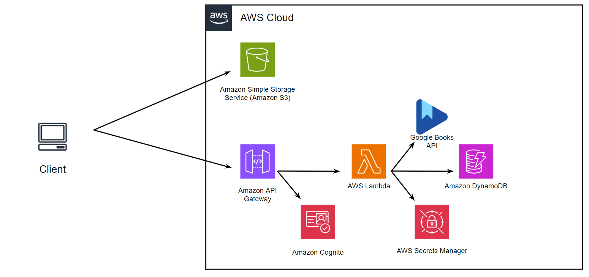

# reading-tracker
# Deployment Chart


## Overview

This project implements a web application where users can search for books using the Google Books API and store selected books in a DynamoDB table. The application serves a frontend hosted in an S3 bucket and a Flask backend running on an EC2 instance.

## How to get Google Books API
1. Create a Google Cloud Project
Go to the Google Cloud Console.
Click on Select a Project at the top, then click on New Project.
Give your project a name (e.g., GoogleBooksAPIProject) and click Create.
2. Enable the Google Books API
Once your project is created, go to the API Library.
Search for Google Books API.
Click on it, then click Enable.
3. Generate an API Key
Go to the Credentials page.
Click + Create Credentials and select API Key.
Your new API key will be generated. Copy this key, as you'll need it to make requests.
4. Set Up API Restrictions (Optional but Recommended)
To prevent unauthorized use of your API key, you can restrict it:
Click on the API key you just created.
Under Application restrictions, you can limit it to certain HTTP referrers (for web apps) or IP addresses (for server-side apps).
Under API restrictions, you can limit it to only the Google Books API.

## AWS Secrets Setup
Step-by-Step Guide to Create the Secret
Log in to AWS Management Console:

Go to AWS Management Console.
Sign in using your credentials.
Navigate to Secrets Manager:

Type Secrets Manager in the search bar and click on it.
Create a New Secret:

Click on Store a new secret.
Select Other type of secret.
Add the Key-Value Pair:

In the Key field, enter: googlebooks
In the Value field, enter your Google Books API Key (e.g., AIzaSyDXXXXXXX...).
Set the Secret Name:

Click Next.
Enter Secret Name as reading_test_key.

Review and Store:

Review the details to ensure everything is correct.
Click Store.

## Launch the API

To launch the Flask API, ensure that your EC2 instance has a security group that allows HTTP (port 8080) and SSH (port 22) access. You can verify your security groups using the AWS CLI:

```bash
aws ec2 describe-security-groups
```
To create and launch the EC2 instance with the appropriate IAM role and user data for installing the necessary dependencies and running your application, use the following command:
```
aws ec2 run-instances --image-id ami-06b21ccaeff8cd686 --instance-type t2.micro --key-name vockey --security-groups httpssh readingtracker-http --user-data file://userdata.sh --tag-specifications 'ResourceType=instance,Tags=[{Key=Name,Value=readingtrackerdynamo}]' --iam-instance-profile Name=LabInstanceProfile
```

Changes to the Server
This version of the application interacts with a DynamoDB table to store book information. Make sure to create a DynamoDB table named bookshelf with the following configuration:

Table name: bookshelf
Partition key: ISBN (String)
All other settings can be kept as default.

Update the Static Webpage
The JavaScript in index.html uses the variable server to know where to get the API. This variable should be declared as follows:
```
const server = 'http://YOUR-EC2-INSTANCE-IP:8080';
```

After you add the IP address, upload the modified index.html file to your S3 bucket:
```
aws s3 cp index.html s3://<your-s3-bucket-name>
```

DynamoDB Table Creation
Your application will automatically create the bookshelf table when the dynamo_shelf.py script is executed. Here’s a simplified structure for your table:
```
{
  "BookID": "1234567890",
  "Title": "Example Book Title",
  "Author": "Author Name",
  "PageCount": 250
}
```

1. Sign in to the [AWS Management Console](https://aws.amazon.com/console/).
2. Open the **S3** service by searching for "S3" in the top search bar.
3. In the S3 Dashboard, click on **Create bucket**.
4. Enter the following settings:
   - **Bucket Name**: `reading-tracker-assets` (you can choose a unique name if this is taken).
   - **AWS Region**: Choose a region close to your users or application.

5. **Bucket Settings for Object Ownership**:
   - Select **ACLs disabled** for best security practices.
   - Choose **Bucket owner enforced** to ensure full control over uploaded objects.

6. **Block Public Access Settings**:
   - **Block all public access** is enabled by default. Keep this enabled unless you specifically need public access.

7. **Additional Settings**:
   - **Versioning**: (Optional) Enable if you want to keep multiple versions of user-uploaded files.
   - **Encryption**: (Recommended) Enable server-side encryption to secure data at rest.

8. Click **Create bucket**.

### Step 2: Set Up Access Policies

To allow the Reading Tracker application to upload and manage files, configure an access policy for the bucket.

#### Creating a Bucket Policy

1. In the S3 Dashboard, open the **reading-tracker-assets** bucket and go to the **Permissions** tab.
2. Scroll down to **Bucket policy** and add the following JSON policy:

```
{
  "Version": "2012-10-17",
  "Statement": [
    {
      "Effect": "Allow",
      "Principal": "*",
      "Action": "s3:GetObject",
      "Resource": "arn:aws:s3:::your-bucket-name/*"
    }
  ]
}
```


EC2 User Data Script
Your userdata.sh script should look similar to this:
```
#!/bin/bash
# Install Git
sudo yum install -y git

# Clone the repository
git clone https://github.com/cadizsd/reading_test.git /home/ec2-user/reading_test

# Move to the repository directory
cd /home/ec2-user/reading_test || exit

# Set up the Python virtual environment
sudo python3 -m venv .venv
source .venv/bin/activate

# Install required dependencies
.venv/bin/pip install -r requirements.txt

# Copy the service file and enable the service
sudo cp reading.service /etc/systemd/system
sudo systemctl daemon-reload
sudo systemctl enable reading
sudo systemctl start reading
```

This script installs the necessary dependencies and starts your Flask application upon instance launch.

Verify the Setup
After launching your instance and running the user data script, you can connect to your instance via SSH to check the logs and ensure everything is running smoothly:
```
ssh -i ~/.ssh/vockey.pem ec2-user@<instance-IP>
```
Monitor the deployment log:
```
tail -f /var/log/cloud-init-output.log
```
Once the instance is up and running, you should be able to access your application via the s3 bucket URL.
